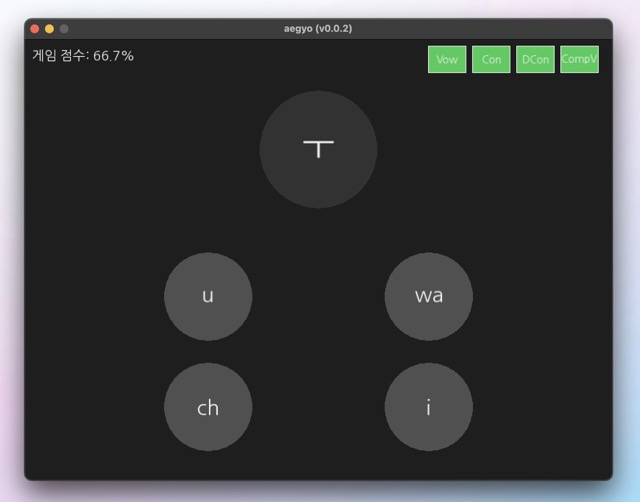

# aegyo

[](https://github.com/ryouze/aegyo/actions/workflows/ci.yml)
[](https://github.com/ryouze/aegyo/actions/workflows/release.yml)


A cross-platform GUI app for learning Korean Hangul.



## Motivation

When I was learning Japanese kana, I liked the idea of drilling the characters into my memory through pure brute-force repetition. I found an iOS app called [Kana School](https://apps.apple.com/us/app/kana-school-japanese-letters/id1214626499) that did exactly that. Unfortunately, I couldn't find a similar app for Korean Hangul, so I decided to create one myself.

## Features

- Written in modern C++ (C++17).
- Verified for accuracy by a Korean language teacher.

## Tested Systems

This project has been tested on the following systems:

- macOS 15.2 (Sequoia)
- Manjaro 24.0 (Wynsdey)
- Windows 11 23H2

Automated tests are also run on the latest versions of macOS, GNU/Linux, and Windows using GitHub Actions.

## Pre-built Binaries

Pre-built binaries are available for macOS (ARM64), GNU/Linux (x86_64), and Windows (x86_64). You can download the latest version from the [Releases](../../releases) page.

To remove the quarantine attribute on macOS, use the following commands:

```sh
xattr -d com.apple.quarantine aegyo-macos-arm64.app
chmod +x aegyo-macos-arm64.app
```

On Windows, the OS may warn you that the binary is unsigned. You can bypass this warning by clicking "More info" and then "Run anyway".

## Requirements

To build and run this project, you'll need:

- C++17 or higher
- CMake

## Build

1. **Clone the repository**:

   ```sh
   git clone https://github.com/ryouze/aegyo.git
   ```

2. **Generate the build system**:

   ```sh
   cd aegyo
   mkdir build && cd build
   cmake ..
   ```

   Optionally, you can disable compiler warnings by setting `ENABLE_COMPILE_FLAGS` to `OFF`:

   ```sh
   cmake .. -DENABLE_COMPILE_FLAGS=OFF
   ```

3. **Compile the project**:

   ```sh
   cmake --build . --parallel
   ```

After a successful build, you can run the program using `./aegyo` (`open aegyo.app` on macOS). However, installing the program is recommended so that it can be run from any directory. See the [Install](#install) section below.

> [!TIP]
> The build type is set to `Release` by default. To build in `Debug` mode, use `cmake .. -DCMAKE_BUILD_TYPE=Debug`.

## Install

If you haven't already built the project, follow the steps in the [Build](#build) section and make sure you are in the `build` directory.

To install the program, use the following command:

```sh
sudo cmake --install .
```

On macOS, this installs the program to `/Applications`. You can then run `aegyo.app` from Launchpad, Spotlight, or by double-clicking the app in Finder.

## Usage

To start the program, run the `aegyo` executable (`aegyo.app` on macOS, or `open /Applications/aegyo.app` from the terminal).

### Controls

You can select the correct answer by clicking it or by pressing the corresponding number key on your keyboard (1, 2, 3, or 4).

The buttons in the top-right corner toggle the character categories:

- `Vow` for Basic Vowels
- `Con` for Basic Consonants
- `DCon` for Double Consonants
- `CompV` for Compound Vowels

All categories are enabled by default. You can disable a category by clicking the corresponding button.

> [!TIP]
> If you're a beginner, start with the `Vow` category and gradually enable the other categories as you continue learning.

## Testing

Tests are included in the project but are not built by default.

To enable and build the tests manually, run the following commands from the `build` directory:

```sh
cmake .. -DBUILD_TESTS=ON
cmake --build . --parallel
ctest --output-on-failure
```

## Credits

- [fmt](https://github.com/fmtlib/fmt)
- [Language](https://macosicons.com/#/u/Bonjour)
- [Let's Learn Hangul!](http://letslearnhangul.com/)
- [Nanum Gothic](https://fonts.google.com/specimen/Nanum+Gothic)
- [Simple and Fast Multimedia Library 3](https://github.com/sfml/sfml)
